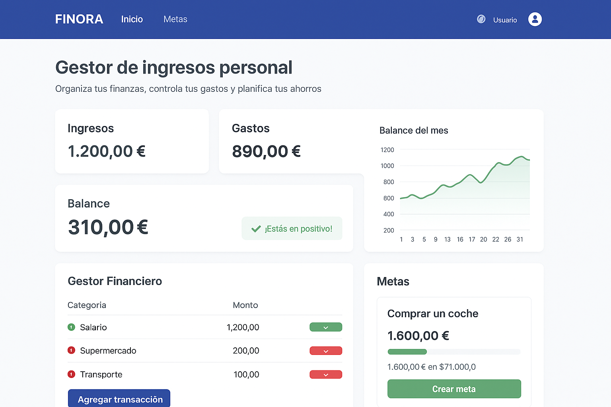

# FINORA

Nuestra App se trata de un gestor de ingresos personal.


*Boceto provisional de la App*

## Indice

- [Introducción](#introduccion)
- [Funciones de la App](#funciones-de-la-app)
- [Requisitos](#requisitos)
- [Instalación](#instalación)
- [Uso](#uso)
- [Licencia](#licencia)


### :rocket: Introduccion
---
Con esta App podras controlar tus gastos y hacer un plan de ahorro para planear futuras inversiones o ahorrar una cantidad deseada de dinero para comprarte algo que desees.

### :gear: Funciones de la App
---
* Plan de ingresos y gastos que calcula tu situacion financiera en un tiempo estimado.

* PONTE UNA META!!! Asi podras concentrarte en ahorrar el dinero que necesitas para comprarte el coche que necesitas.

* Un apartado con notacias e inversiones como (ETFs, Aciones y Criptos), asi podras decidir tu mejor metodo para invertir.

### :clipboard: Requisitos
---
Para ejecutar correctamente el proyecto, asegúrate de tener instalado:

* Node.js

* Angular CLI

* Docker

### :package: Instalación  
---
:rocket:
Sigue estos pasos para instalar y configurar el proyecto en tu equipo:  

1. **Clonar el repositorio**  
    ```bash
   git clone https://github.com/tu-usuario/PROYECTO2-DAW.git

   cd PROYECTO2-DAW
    ```

2. Instalar dependencias del proyecto
Asegúrate de tener Node.js y npm instalados. Luego, ejecuta:

    ```bash
    npm install
    ```

3. Instalar Angular CLI (si no lo tienes ya)

    ```bash
    npm install -g @angular/cli
    ```

4. Levantar el servidor de desarrollo

    ```bash
    ng serve
    ```

5. (Opcional) Ejecutar con Docker
Si quieres usar Docker en lugar de npm/Angular directamente:

    ```bash
    docker-compose up --build
    ```

### :computer: Uso  
---
A continuación, algunos ejemplos de cómo utilizar la aplicación **FINORA**:  

1. **Registro de usuario**  
   - Ingresa con tu correo y crea una cuenta.  
   - Una vez dentro, podrás personalizar tu perfil financiero.  

2. **Añadir ingresos y gastos**  
   - Ve al apartado **Gestor Financiero**.  
   - Introduce tus ingresos mensuales y registra tus gastos habituales.  
   - La aplicación calculará automáticamente tu balance financiero.  

3. **Crear una meta de ahorro**  
   - Accede a la sección **Metas**.  
   - Define un objetivo (ejemplo: “Comprar un coche” o “Ahorrar para un viaje”).  
   - Establece la cantidad de dinero y el plazo estimado.  
   - FINORA te mostrará cuánto necesitas ahorrar semanal o mensualmente.  

4. **Consultar noticias e inversiones**  
   - Dirígete al apartado **Inversiones**.  
   - Revisa las últimas noticias sobre **ETFs, acciones y criptomonedas**.  
   - Evalúa opciones y toma mejores decisiones financieras.

### :scroll: Licencia  
---
Este proyecto está bajo la licencia **MIT**.  
Consulta el archivo [LICENCIA](LICENCIA) para más información. 


